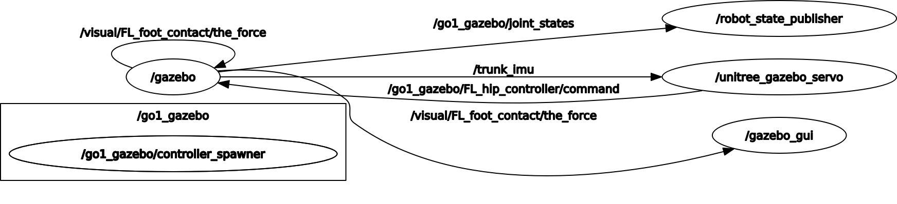

# go1_vision — Simulation Module

**Generalised trajectory planning and reactive semantic control for the Unitree Go1 quadruped in Gazebo.**

This repository contains the simulation component of the work described in:

> C. Lardín Sánchez, J. A. Corrales Ramón, R. Iglesias Rodríguez, A. March-Ramón and E. Martínez-Martín,
> *"Distributed Hybrid Control Architecture for Quadrupeds in Human-Robot Interaction Tasks"*.
> Centro Singular de Investigación en Tecnologías Inteligentes (CiTIUS), Universidade de Santiago de Compostela,
> and Department of Computer Science and Artificial Intelligence, Universidad de Alicante.

The broader project proposes a distributed, three-level control architecture (sensor-, robot- and external-computing)
that enables semantic navigation and non-verbal human–robot interaction (HRI) on a physically and computationally
constrained quadruped. This repository focuses specifically on the **external-computing simulation layer**: a
high-fidelity Gazebo environment used to develop, tune and validate the reactive trajectory-planning behaviours
*before* they are deployed on the real robot.

---

## Overview

Standard topological planners (cost-maps combined with Dijkstra or A\*) tend to fail in densely cluttered indoor
scenarios because of sudden visual occlusions, unmapped dynamic entities, and the severe motion blur produced by the
quadruped's trotting gait. To address this, the simulation module augments the primary point-to-point navigation with
a set of **parallel objective functions** that run concurrently within a high-frequency control loop.

The reactive layer is driven by an instance-segmentation model (**YOLOv8-Seg**) and modifies the robot's base
trajectory in real time to satisfy three simultaneous goals:

- **Continuous human tracking** — pursuing a dynamic target from an initial to a final semantic point.
- **Vision-based obstacle avoidance** — bypassing low-profile, unmapped hazards (e.g. cinder blocks) that
  topological maps typically miss and which represent serious tripping hazards for a legged platform.
- **Robustness to sensory degradation** — sustaining pursuit through momentary tracking losses caused by
  occlusions and motion blur.

Crucially, the reactive avoidance layer is calibrated to intervene *proactively*, executing evasive manoeuvres
before a spatial conflict can trigger the Go1's proprietary self-preservation mechanism (which cuts motor torque and
drops the chassis into a passive damping state, aborting the mission).

### Kinematic control

The lateral steering error is derived from the horizontal centroid of the selected target's normalised
segmentation bounding box (`xyxyn ∈ [0, 1]`) and drives the angular velocity through a proportional controller:

```
e_yaw = (x_min + x_max) / 2 − 0.5
ω_z   = K_p · e_yaw
```

The bounding-box width (`w = |x_max − x_min|`) acts as an inversely proportional depth estimator that modulates the
linear velocity `v_x`, with a critical stopping threshold `τ_stop` that halts the robot before a collision.

### Finite State Machine (FSM)

A Finite State Machine governs the semantic pursuit and the tactical search behaviours under occlusion. A
patience threshold (`t_loss > 2.5 s`) keeps the last known pursuit vector alive during momentary tracking losses.
When the target is lost beyond that threshold, the FSM escalates through a sequence of tactical sweep patterns:

| State                        | Behaviour                                                            |
|------------------------------|----------------------------------------------------------------------|
| `EVALUATING`                 | Assess the current semantic state and decide the next transition.    |
| `APPROACHING`                | Drive towards the tracked target while monitoring for collisions.    |
| `ALIGNING`                   | Correct the yaw error when the target drifts outside the dead-zone.  |
| `SPINNING_LEFT` / `SPINNING_RIGHT` | **Local sweep** — pure yaw rotations to reacquire the target.  |
| `GLOBAL_TURN`                | **Global U-turn** — a timed spatial-grid search from new vantage points. |
| `VICTORY_BRAKE`              | Controlled stop once the critical stopping width is reached.         |

### Reactive repulsive vector

Every non-target segmentation box is evaluated as a potential threat. An obstacle is treated as imminent when it
simultaneously (a) occupies more than **15 %** of the pixel area and (b) extends into the lower **40 %** of the visual
field (i.e. close to the legs). Upon detection, the linear speed is abruptly reduced to a safety micro-step
(`v_safe = 0.03 m/s`) and a repulsive angular velocity `ω_repulsive`, proportional but opposite in sign to the
obstacle's horizontal offset, is applied — allowing the quadruped to bypass the hazard purely from 2D semantic data,
without global replanning.

---

## Repository structure

```
ros_docker/
├── Dockerfile                     # Containerised ROS Noetic + Gazebo 11 environment
├── docs/                          # Documentation assets
│   └── rosgraph.png               # ROS computation graph
└── catkin_ws/
    └── src/
        └── go1_vision/            # This package
            ├── CMakeLists.txt
            ├── package.xml
            ├── launch/
            │   └── simulation.launch
            ├── scripts/           # ROS nodes (see reference below)
            ├── srv/
            │   └── FindPerson.srv
            └── worlds/
                └── oficina_laboratorio.world
```

> **Note.** The third-party Unitree SDKs and ROS packages (`unitree_ros`, `unitree_guide`,
> `unitree_legged_sdk`, `unitree_ros_to_real`, `UnitreecameraSDK`), the compiled `build/` and `devel/`
> spaces, and the neural-network weight files (`*.pt`) are intentionally excluded from version control via
> `.gitignore`. Only the original simulation and control architecture is tracked here.

---

## Requirements

- **Ubuntu 20.04 LTS**
- **ROS Noetic**
- **Gazebo 11** (required for compatibility with the Unitree Go1 virtual model)
- **Python 3** with:
  - [`ultralytics`](https://github.com/ultralytics/ultralytics) (YOLOv8)
  - `opencv-python`
  - `cv_bridge`
  - `mediapipe` (only for the real-robot pose node)

### Third-party dependencies

Because the manufacturer packages are not redistributed here, clone them into `catkin_ws/src/` alongside
`go1_vision` before building:

- [`unitree_ros`](https://github.com/unitreerobotics/unitree_ros) — Go1 description and Gazebo integration.
- [`unitree_guide`](https://github.com/unitreerobotics/unitree_guide) — low-level locomotion controller.
- `unitree_legged_sdk`, `unitree_ros_to_real`, `UnitreecameraSDK` — real-hardware interfaces (optional for
  simulation).

### Model weights

The YOLOv8 segmentation weights (e.g. `yolov8x-seg.pt`) are **not** committed, as they exceed sensible limits for
version control. `ultralytics` will download them automatically on first run, or you may place them manually in the
working directory.

---

## Building

```bash
cd catkin_ws
catkin_make
source devel/setup.bash
```

---

## Running the simulation

```bash
roslaunch go1_vision simulation.launch
```

This launch file invokes the standard Unitree `normal.launch` from your own workspace, injecting the robot name
(`rname:=go1`) and the custom world (`wname:=oficina_laboratorio`). Following standard ROS practice, third-party
source is never modified — it is called and parameterised from this package.

> **Important — custom world.** The upstream `normal.launch` resolves the world path as
> `$(find unitree_gazebo)/worlds/$(arg wname).world`, so it accepts a world *name* rather than an arbitrary path.
> The canonical, version-controlled copy of the environment lives in this package
> (`worlds/oficina_laboratorio.world`). For the simulation to load it, copy it into the Unitree package once:
>
> ```bash
> cp catkin_ws/src/go1_vision/worlds/oficina_laboratorio.world \
>    catkin_ws/src/unitree_ros/unitree_gazebo/worlds/
> ```

Once Gazebo is running, start the reactive semantic-control node:

```bash
rosrun go1_vision person_detector.py
```

### Running the full simulation stack (Docker)

The complete demonstration is orchestrated across several terminals attached to a single container built from the
provided `Dockerfile` (image tag `ros-noetic-go1`). Each terminal hosts one long-running process; open them in
order. The paths below assume the workspace is mounted at `/catkin_ws` and the repository lives at
`$HOME/ros_docker`.

**Terminal 1 — container and Gazebo.** Grant the local X server access to the container, launch it with GPU/display
forwarding, and bring up Gazebo with the desired world:

```bash
xhost +local:docker

docker run -it --rm \
    --env="DISPLAY" \
    --env="QT_X11_NO_MITSHM=1" \
    --env="LIBGL_ALWAYS_SOFTWARE=1" \
    --volume="/tmp/.X11-unix:/tmp/.X11-unix:rw" \
    --volume="$HOME/ros_docker/catkin_ws:/catkin_ws" \
    --device=/dev/dri:/dev/dri \
    --net=host \
    --privileged \
    ros-noetic-go1 \
    bash

# Inside the container:
source /catkin_ws/devel/setup.bash

# Paper scenario (the asymmetric office environment):
roslaunch unitree_gazebo normal.launch rname:=go1 wname:=oficina_laboratorio

# Alternatively, a simpler baseline world for tuning:
# roslaunch unitree_gazebo normal.launch rname:=go1 wname:=earth
```

> All subsequent terminals attach to the **same** running container via
> `docker exec -it $(docker ps -q -f ancestor=ros-noetic-go1) bash`.

**Terminal 2 — controllers, locomotion bridge and reset helper.** Start the joint servos, run the `/cmd_vel`
locomotion bridge, and register a convenience alias that teleports the robot back to its start pose (useful after a
fall triggers the Go1 passive damping state):

```bash
docker exec -it $(docker ps -q -f ancestor=ros-noetic-go1) bash

rosrun unitree_controller unitree_servo
rosrun go1_vision junior_bridge.py

# Register the reset-robot alias (once), then reload the shell or run it directly:
echo "alias reset-robot=\"rosservice call /gazebo/set_model_state '{model_state: { model_name: 'go1_gazebo', pose: { position: { x: 0.0, y: 0.0, z: 0.4 }, orientation: {x: 0.0, y: 0.0, z: 0.0, w: 1.0} }, reference_frame: 'world' } }'\"" >> ~/.bashrc
reset-robot
```

**Terminal 3 — dynamic human target.** Spawn a walking-person model to act as the tracked target, and delete it when
finished:

```bash
docker exec -it $(docker ps -q -f ancestor=ros-noetic-go1) bash

rosrun gazebo_ros spawn_model -database person_standing -sdf -model persona_test -x 2.0 -y 1.0 -z 0.0
rosservice call /gazebo/delete_model "{model_name: 'persona_test'}"
```

**Terminal 4 — reactive semantic-control node.** Launch the FSM-driven pursuit and obstacle-avoidance node:

```bash
docker exec -it $(docker ps -q -f ancestor=ros-noetic-go1) bash

rosrun go1_vision person_detector.py
```

**Terminal 5 — service trigger.** Invoke the `/find_person` service to initiate a search/follow cycle on demand:

```bash
docker exec -it $(docker ps -q -f ancestor=ros-noetic-go1) bash

rosservice call /find_person
```

**Terminal 6 — image inspection.** Visualise the camera and annotated-detection streams:

```bash
docker exec -it $(docker ps -q -f ancestor=ros-noetic-go1) bash

rqt_image_view
```

**Terminal 7 — standalone detector (optional).** Run the independent YOLOv8-Seg detector for isolated inspection of
the segmentation output:

```bash
docker exec -it $(docker ps -q -f ancestor=ros-noetic-go1) bash

python3 /catkin_ws/src/go1_vision/scripts/yolo_detector.py
```

---

## Node reference

| Node                       | Role                                                                                          |
|----------------------------|-----------------------------------------------------------------------------------------------|
| `person_detector.py`       | **Core simulation node.** YOLOv8-Seg segmentation, FSM-driven semantic pursuit, and the reactive repulsive obstacle-avoidance layer. |
| `yolo_detector.py`         | Standalone YOLOv8-Seg inference on the simulated front-camera stream (with 180° correction).   |
| `person_detector_real.py`  | Real-robot counterpart using MediaPipe pose estimation.                                        |
| `test_hardware.py`         | Basic `/cmd_vel` motion test (forward, stop, reverse) for hardware bring-up.                   |
| `final_bridge.py`          | Bridges `/cmd_vel` to the Gazebo joint controllers (`MotorCmd`).                               |
| `fix_cmd_vel.py`           | Minimal `/cmd_vel` → hip-controller bridge that exposes the topic for teleoperation.           |
| `junior_bridge.py`         | Bridges `/cmd_vel` to the `unitree_guide` `junior_ctrl` controller via a pseudo-terminal.      |
| `vision_to_keyboard.py`    | Injects keystrokes into a target TTY from `/cmd_vel` commands.                                 |

The ROS computation graph of the running system is shown below:

<p align="center">
  
</p>

### Services

| Service        | Type                     | Response fields          |
|----------------|--------------------------|--------------------------|
| `/find_person` | `go1_vision/FindPerson`  | `bool success`, `string message` |

### Key topics

| Topic                          | Direction | Description                          |
|--------------------------------|-----------|--------------------------------------|
| `/camera_face/color/image_raw` | in        | Front-camera image stream.           |
| `/cmd_vel`                     | out       | Velocity commands to the locomotion controller. |
| `/person_pose`                 | out       | Estimated pose of the tracked person.|

---

## Validation

In simulation, the refined reactive layer correctly identified unmapped threats, dynamically overrode its primary
pursuit trajectory to bypass the obstacle, and immediately resumed tracking in **100 %** of the critical encounters
tested within the laboratory environment — proactively preventing the quadruped's hardware-level passive damping
state without incurring the computational cost of global topological replanning.

---

## Authors

- **Carmen Lardín Sánchez**, Juan Antonio Corrales Ramón, Roberto Iglesias Rodríguez — CiTIUS, Universidade de
  Santiago de Compostela.
- **Adrián March-Ramón**, Ester Martínez-Martín — Department of Computer Science and Artificial Intelligence,
  Universidad de Alicante.

## Funding

Partially funded by the Spanish AEI and MICIU through projects PID2023-153341OB-I00 and CNS2024-154907
(-FedeMINDex-); by the Interreg VI-B SUDOE Programme through ROBOTA-SUDOE (Ref. S1/1.1/P0125); and by the European
Union (European Regional Development Fund — ERDF).

## Licence

See the corresponding publication for citation requirements. Third-party Unitree packages remain subject to their
respective licences.
